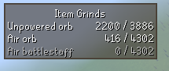

# skilling grind tracker 

A plugin for helping you keep track of skilling grinds.

## Features

* Lets you keep track of single items, or chained items
* Caches bank counts and more
* Updates live

## Colour Meanings

| Colour | Meaning                |
|--------|------------------------|
| Green  | You have met your goal |
| White  | You are working on it  |
| Grey   | Not yet started        |

## Configuration

### Goal

`567:100` means you want 100 of item ID 567
`567->573:100` means you want 100 of item ID 573, and they are made from item ID 567.

You can add more goals to the config by separating them with a comma:
`567:100,4151:1` means you want 100 orbs and 1 abyssal whip

## Example

### Configuration
`567->573->1397:4302`

This means I want 4302 of item 1397 (Air battlestaff), which are made from 573 (Air orb), which are made from 567 (Unpowered orb).

If I open my bank where I own 0 Air battlestaffs, 416 air orbs and 2200 unpowered orbs, it renders like this:

